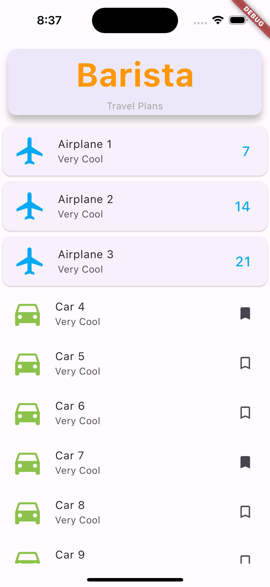

# ch9_listview

In this example, the ListView widget uses the builder to display a Card for the header
and two variations of the ListTile for the data list.

## ListTile
The ListTile can display `"leading"` and `"trailing""` widgets.
The `"leading""` property shows and Icon but could have displayed and Image.
For the `"trailing"` property, the frist type of `"ListTile"` shows data as a percentage,

The second `"ListTile"` shows a selected or unselected bookmark `"Icon"`.

You can also set a `""title && subtitle propery for it"`

## ListView.builder Example

 